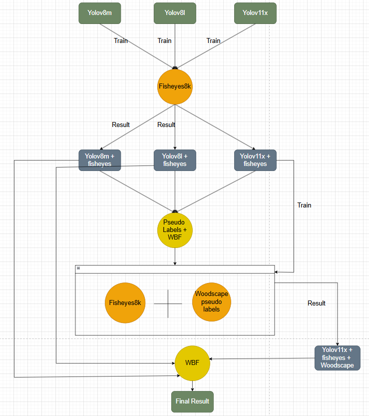
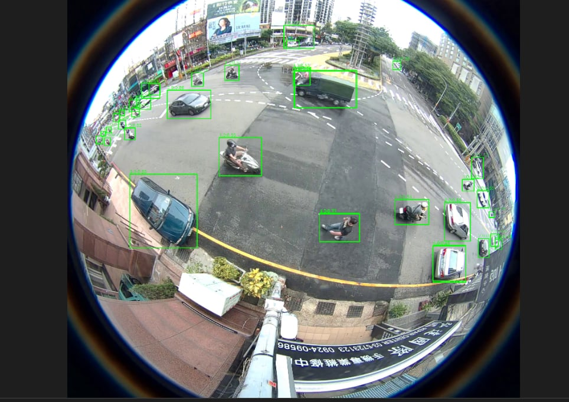
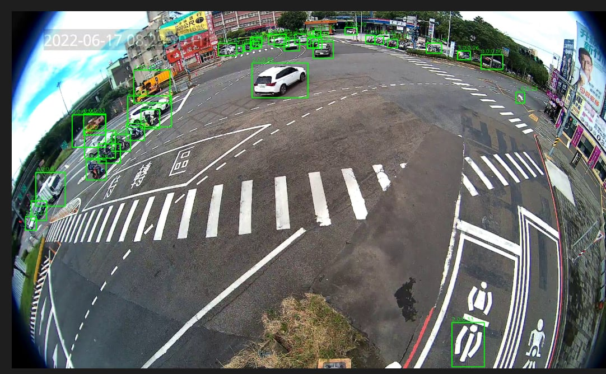

# Road Object Detection by Fisheye Cameras

## Overview

This project focuses on **road object detection** (Bus, Bike, Car, Pedestrian, Truck) using **fisheye camera images**.  
The dataset is based on **Fisheye8K / Woodscape**, containing multiple camera views (front, rear, left, right).

The main objectives are:
- Train and optimize multiple YOLO-based object detection models.
- Apply **Weighted Boxes Fusion (WBF)** to ensemble multiple YOLO predictions.
- Generate **pseudo-labels** for unlabeled fisheye datasets.

---
## Table of Contents
- [Overview](#overview)
- [Project Structure](#project-structure)
- [Instruction](#instruction)
  - [Installation](#installation)
  - [Dataset Preparation](#dataset-preparation)
  - [Training](#training)
    - [Yolov8m](#yolov8m)
    - [Yolov8l](#yolov8l)
    - [Yolov11x](#yolov11x)
  - [Inference](#inference)
    - [Yolov8m](#yolov8m)
    - [Yolov8l](#yolov8l)
    - [Yolov11x](#yolov11x)
- [Model Architecture](#model-architecture)
- [Result](#result)
- [Contact](#contact)


---
## Project Structure

<pre style="background-color:#f6f8fa; padding:10px; border-radius:6px; font-size:14px;"><code>
Road_Object_Detection_By_Fisheyes/
│
├── Compare_Models/
│   ├── Faster_Rcnn/
│   ├── Yolov_11x/
│   ├── Yolov8_l/
│   └── Yolov8_m/
│
├── DataSets/
│   ├── Fisheye8K_all_including_train&test/
│   └── Fisheyes1K/
│
├── Models_Architecture/
│   ├── FasterRcnn/
│   ├── Yolov8/
│   └── Yolov11/
│
├── Models_save/
│   ├── Faster_Rcnn/
│   ├── Yolov8_Fisheye/
│   └── Yolov11_Fisheye/
│
├── Predict/
│   ├── Faster_Rcnn/
│   ├── Yolov8/
│   └── Yolov11/
│
├── Wbf/
│   ├── Config/
│   ├── Pseudo_Woodscape/
│   └── Wbf_1K/
├── Check_Gpu.py
├── Check_label.py
├── Read_train_and_test_combine.py
├── Rename_Woodscape.py
├── Train_Test_combine.py
├── requirements.txt
└── README.md
</code></pre>

---
## Instruction
#### Installation 

1. **Clone the repository**
   ```bash
   git clone https://github.com/tominhduc01082003/Road_Object_Detection_By_Fisheyes
   cd Road_Object_Detection_By_Fisheyes
2. **Setup environement** 
   ```bash
     python --version
     python -m venv .venv
    .venv/Scripts/activate  # Windows
     # or
     python3.9 --version
     python3.9 -m venv .venv
    .venv39/bin/activate  # Linux/MacOS  
3. **Install Dependencies**
   ```bash
   pip install -r requirements.txt
   ```
   **Window**: Key packages include torch=2.7.1,cuda 11.8, ultralytics, opencv-python, matplotlib, numpy, and optional logging tools (tensorboard, comet_ml, clearml).
   **Linux,MacOs**:pip install torch=2.0.1 torchvision=0.15.2 torchaudio=2.0.2 --index-url https://download.pytorch.org/whl/cu118
   pip install mmcv-full=1.7.2 -f https://download.openmmlab.com/mmcv/dist/cu118/torch2.0.0/index.html
   pip install openmim
   mim install mmdet=2.28.2
   pip install mmengine=0.10.4
4. **Verify GPU Support**
   Check GPU availability
   ```bash
   python Check_Gpu.py
---
####  Dataset Preparation

1. **Fisheye8K:** The primary dataset for training and validation, containing fisheye images from multiple camera views (front, rear, left, right) with annotations for Bus, Bike, Car, Pedestrian, and Truck.Train and test are stored in DataSets/Fisheye8K_all_including_train&test.
- Download the Fisheye8K dataset, and put the data into ./DataSets/Fisheye8K_all_including_train&test/. Link to the fisheye8k dataset :https://github.com/MoyoG/FishEye8K
2. **Fisheyes1K:** A smaller subset used for evaluation.This dataset is used to test model performance and WBF ensemble.
- Download the Fisheye1K dataset, and put the data into ./DataSets/Fisheyes1K/Fisheyes1K_Eval/. Link to the fisheye1k dataset :https://scidm.nchc.org.tw/en/dataset/fisheye1keval
3. **Woodscape:** A datasets use- A large-scale fisheye dataset designed for autonomous driving applications.Contains high-resolution, 360° fisheye images captured under different lighting and weather conditions.Used for **pseudo-label generation** and **model generalization**.  
- Download the Woodscape dataset, and put the data into ./DataSets/Fisheye8K_all_including_train&test/Woodscape/. Link to the Woodscape dataset :https://github.com/valeoai/WoodScape?tab=readme-ov-file
- Merge **train and test** in Woodscape into 1 folder name **'images'** locate in DataSets/Fisheye8K_all_including_train&test/Woodscape/

4. **Standardize Filenames:** Run Rename_Woodscape.py to rename images to a consistent format (e.g., cameraX_scene_frame).
    ```bash
    python Rename_Woodscape.py
5. **Pseudo Woodscape:** Run Pseudo_Label.py to make labels .txt Woodscape
    ```bash
    cd ./Wbf/Pseudo_Woodscape
    python Pseudo_Label.py

6. **Combine Splits:** Use Train_Test_combine.py to merge Fisheye8K train and test sets and woodscape and save into \DataSets\Fisheye8K_all_including_train&test\train_test_merged.
    ```bash
    python Train_Test_combine.py
7. **Validate Labels:** Use Check_label.py to ensure labels follow YOLO format (class, x_center, y_center, width, height).
     ```bash
    python Check_label.py
---

#### Training
##### Yolov8m
1. **Configure model**  
   Open the file `Train.py` located in the Yolov8 model directory, and modify the model configuration as follows:

   ```python
   model = YOLO("yolov8m.pt")
2. **Open terminal** :
   ```python
   cd ./Models_Architecture/Yolov8/Model/
   python Train.py
##### Yolov8l
1. **Configure model**  
   Open the file `Train.py` located in the Yolov8 model directory, and modify the model configuration as follows:

   ```python
   model = YOLO("yolov8l.pt")
2. **Open terminal** :
   ```python
   cd ./Models_Architecture/Yolov8/Model/
   python Train.py
##### Yolov11X:
1. **Open terminal** :
   ```python
   cd ./Models_Architecture/Yolov11/Model/
2. **Train with fisheyes**
   ```python
   python Train.py
3. **Train ensemble fisheyes + Woodscape**
**Convert train,val** in ./Models_Architecture/Yolov11/Config/Config_Hyper.yaml :
train: "train_test_merged\\images" # 8000 images fisheyes8k train + val,10000 images Woodscapes
val:"" #Skip val
**Run** :
    ```python
   cd ./Models_Architecture/Yolov11/Model/
   python Train.py

---

#### Inference
##### Yolov8m and Yolov8l
- **Eval Test and Eval 1K image**  

   ```python
   cd ./Models_Architecture/Yolov8/Eval/
   python Eval_Test.py
   python Eval_1K.py
---
##### Yolov11x
- **Eval Test and Eval 1K image**  

   ```python
   cd ./Models_Architecture/Yolov11/Eval/
   python Eval_Test.py
   python Eval_1K.py

---

##### Ensemble models

- After we have predictions.json in Yolov8m and Yolov8l , Yolov11x(**fisheyes + Woodscape** )

   ```python
   cd ./Wbf/Wbf_1K/
   python Predict_WBF_1K.py 
---
## Model Architecture

---
## Result
  
| **Model**    | **Pretraining Data** | **Data Used**       | **mAP<sub>0.5:0.95</sub>** |
| ------------ | -------------------- | ---------------------------------- | -------------------------- |
| **YOLOv8m**  | COCO                 | Fisheye8K              | **41.23**                  |
| **YOLOv8l**  | COCO                 | Fisheye8K               | **43.26**                  |
| **YOLOv11x** | COCO   | Fisheye8K | **45.52**                  |

---
## Contact
- To Minh Duc (ducto020803@gmail.com)